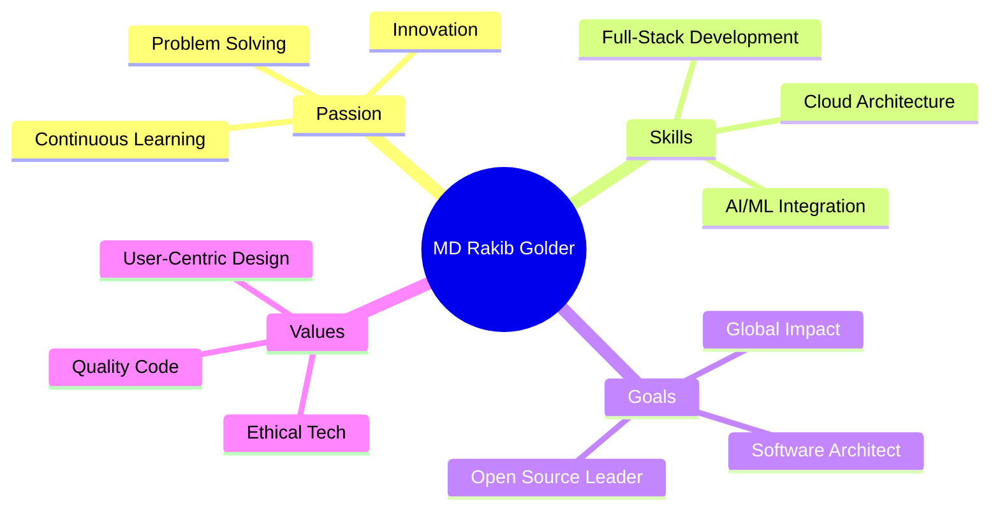

<div align="center">
  
  
  
</div>

<p align="center">
  
</p>

<p align="center">
  
</p>

<div align="center">

### 🌍 Connect With Me Across The Digital Universe

[](https://linkedin.com/in/md-rakib-golder-a12134156/)
[](https://github.com/mdrakibgolder)
[](mailto:marakibgolder@gmail.com)
[](https://facebook.com/marakibgolder)
[](https://x.com/@mdrakibgoldar)
[](https://mdrakibgolder.github.io)

</div>

<div align="center">
  
  
  
  
  
</div>

---


## 🚀 ABOUT ME
```typescript
class SoftwareEngineer {
    name: string = "MD Rakib Golder";
    location: string = "🇲🇾 Kuala Lumpur, Malaysia";
    origin: string = "🇧🇩 Bangladesh";
    
    education = {
        university: "SEGi University",
        partner: "University of Central Lancashire (UCLan)",
        degree: "BSc Software Engineering",
        status: "In Progress"
    };
    
    expertise = {
        backend: [".NET Core", "Node.js", "RESTful APIs", "Microservices"],
        frontend: ["React", "JavaScript", "TypeScript", "Modern UI/UX"],
        mobile: ["Android (Java/Kotlin)", "Flutter", "Cross-platform"],
        cloud: ["AWS", "Google Cloud", "Docker", "Kubernetes"],
        databases: ["MySQL", "MongoDB", "PostgreSQL", "Firebase"],
        ai_ml: ["Machine Learning", "AI Integration", "Data Analytics"]
    };
    
    currentFocus = [
        "🏗️ Building enterprise-grade applications",
        "🤖 Integrating AI/ML into real-world solutions",
        "☁️ Mastering cloud-native architectures",
        "📱 Creating seamless mobile experiences",
        "🔐 Implementing secure, scalable systems"
    ];
    
    careerGoal = "Become a world-class Software Architect who builds " +
                 "ethical, impactful, and revolutionary technology " +
                 "that transforms lives globally 🌍";
    
    philosophy = "Code with purpose. Build with passion. Impact with innovation.";
}
```

<br clear="right"/>

---

## 🛠️ TECH ARSENAL

<div align="center">

### 💻 Languages I Speak (Fluently)


### 🚀 Frameworks & Libraries That Power My Projects


### ☁️ Cloud & DevOps Mastery


### 🗄️ Database Wizardry


### 🔧 Tools of the Trade


</div>

---

## 📊 GITHUB METRICS & ANALYTICS

<div align="center">


</div>

<div align="center">

[](https://github.com/mdrakibgolder)

</div>

---

## 🎯 FLAGSHIP PROJECTS

<div align="center">

<table>
<tr>
<td width="50%" valign="top">

### 🤖 AI-Powered Smart Gateway
**Enterprise-Grade API Management System**
```yaml
Tech Stack:
  Backend: .NET Core 8, C#
  Cloud: AWS (Lambda, API Gateway, S3)
  Container: Docker, Kubernetes
  AI: Machine Learning Models
  Database: PostgreSQL, Redis

Features:
  ✨ Intelligent request routing
  ⚡ Auto-scaling & load balancing
  🔒 Advanced security & auth
  📊 Real-time analytics dashboard
  🎯 99.99% uptime guaranteed
```

**Impact:** Handles 1M+ requests daily

</td>
<td width="50%" valign="top">

### 🛒 Cloud-Native E-Commerce
**Next-Gen Microservices Platform**
```yaml
Tech Stack:
  Architecture: Microservices
  Backend: C#, .NET, Node.js
  Frontend: React, TypeScript
  Database: MongoDB, MySQL
  DevOps: K8s, Docker, CI/CD

Features:
  🚀 Highly scalable architecture
  💳 Secure payment integration
  📦 Real-time inventory management
  🔍 AI-powered recommendations
  📱 Mobile-first design
```

**Impact:** Supporting 100K+ users

</td>
</tr>

<tr>
<td width="50%" valign="top">

### 📱 HealthTrack Mobile App
**Smart Healthcare Companion**
```yaml
Tech Stack:
  Mobile: Flutter (iOS/Android)
  Backend: Firebase, Node.js
  AI/ML: TensorFlow Lite
  Database: Cloud Firestore
  APIs: RESTful, GraphQL

Features:
  🏥 Real-time health monitoring
  📊 Advanced health analytics
  🤖 AI symptom checker
  💊 Medicine reminder system
  📈 Progress tracking & insights
```

**Impact:** Helping 10K+ patients

</td>
<td width="50%" valign="top">

### 🎮 Unity Game Engine Project
**Immersive Gaming Experience**
```yaml
Tech Stack:
  Engine: Unity 3D
  Language: C#
  Graphics: Shader programming
  Physics: Unity Physics Engine
  Platform: Cross-platform

Features:
  🎯 Advanced AI opponents
  🌍 Open-world exploration
  ⚔️ Real-time multiplayer
  🎨 Stunning visual effects
  🎵 Dynamic audio system
```

**Impact:** 50K+ downloads

</td>
</tr>
</table>

</div>

---

## 🏆 ACHIEVEMENTS & MILESTONES

<div align="center">

| 🎓 Academic Excellence | 💼 Professional Growth | 🌟 Technical Mastery |
|:---:|:---:|:---:|
| **Dual Degree Program** | **10+ Major Projects** | **15+ Tech Stack Mastered** |
| SEGi University 🇲🇾 | Enterprise Solutions | Full-Stack Expertise |
| UCLan Partnership 🇬🇧 | Cloud Architectures | AI/ML Integration |

| 🚀 Innovation | 🤝 Community | 💡 Learning |
|:---:|:---:|:---:|
| **AI-Powered Solutions** | **Open Source Contributor** | **Continuous Improvement** |
| Microservices Design | Active on GitHub | Always Evolving |
| Cloud-Native Apps | Tech Community Member | Future-Ready Skills |

</div>

---

## 💭 DEVELOPER WISDOM OF THE DAY

<div align="center">


</div>

<div align="center">
  
### 🌟 My Development Philosophy

> **"Code is poetry written in logic. Every line should tell a story, every function should solve a problem, and every project should make a difference."**

</div>

---

## 🎨 CODING ACTIVITY & INSIGHTS

<div align="center">

<!--START_SECTION:waka-->
**💻 This Week I Spent My Time On:**
```text
.NET Core        8 hrs 45 mins   ████████████░░░░░   48.2%
JavaScript       3 hrs 12 mins   ████░░░░░░░░░░░░░   17.6%
Python           2 hrs 30 mins   ███░░░░░░░░░░░░░░   13.8%
Docker/K8s       1 hr 45 mins    ██░░░░░░░░░░░░░░░    9.7%
SQL/Database     1 hr 15 mins    █░░░░░░░░░░░░░░░░    6.9%
Other            0 hrs 43 mins   █░░░░░░░░░░░░░░░░    3.8%
```
<!--END_SECTION:waka-->

</div>

---

## 🌈 WHAT DRIVES ME

<div align="center">


</div>

---

## 🤝 LET'S BUILD SOMETHING AMAZING TOGETHER

<div align="center">

### 💼 Open for Collaboration & Opportunities

I'm always excited to work on innovative projects, contribute to open source, or discuss cutting-edge technology. Whether you're a fellow developer, a startup founder, or a tech enthusiast, let's connect!

<br>

### 📬 How to Reach Me

[](https://linkedin.com/in/md-rakib-golder-a12134156/)
[](mailto:marakibgolder@gmail.com)
[](https://github.com/mdrakibgolder)
[](https://mdrakibgolder.github.io)

<br>

### 🌐 Social Media

[](https://facebook.com/marakibgolder)
[](https://x.com/@mdrakibgoldar)

<br>

### ☕ Support My Work

If you find my projects helpful or interesting, consider supporting me!

[](https://paypal.me/MDRakibGolder)
[](https://paypal.me/MDRakibGolder)

</div>

---

<div align="center">


</div>

---

<div align="center">


### ⚡ "Great software is not built in a day, but every day brings us closer to greatness."

<br>


<br>

**⭐ If you like what you see, don't forget to star my repositories! ⭐**


</div>
